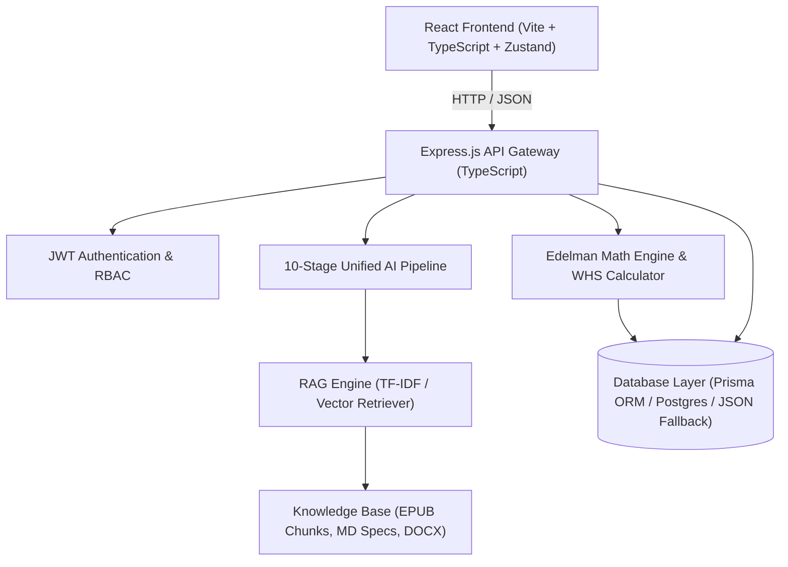
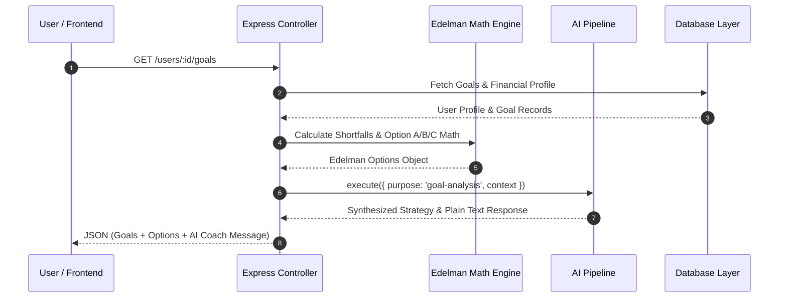
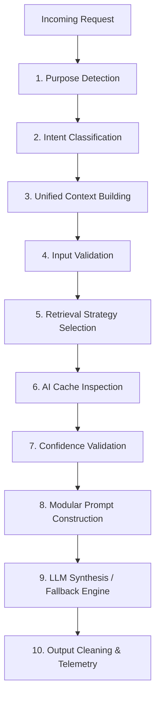
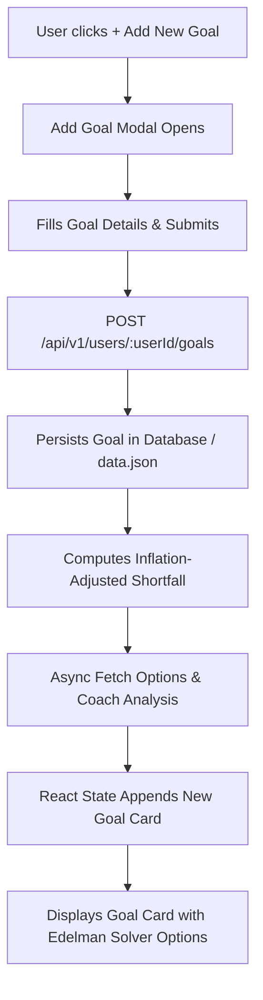

# Weallth Personal Wealth Management (PWM) Module — Technical & Product Documentation

---

## Table of Contents
1. [Project Overview](#1-project-overview)
2. [System Architecture](#2-system-architecture)
3. [Technology Stack](#3-technology-stack)
4. [Module Documentation](#4-module-documentation)
5. [AI & RAG Documentation](#5-ai--rag-documentation)
6. [Database Documentation](#6-database-documentation)
7. [API Documentation](#7-api-documentation)
8. [Application Workflow](#8-application-workflow)
9. [AI Request Flow](#9-ai-request-flow)
10. [Implementation Status](#10-implementation-status)
11. [Security](#11-security)
12. [Performance & Optimization](#12-performance--optimization)
13. [Deployment & Environment Setup](#13-deployment--environment-setup)
14. [Testing & Evaluation](#14-testing--evaluation)
15. [Future Roadmap](#15-future-roadmap)

---

## 1. Project Overview

### 1.1 Project Vision
The **Weallth Personal Wealth Management (PWM) Module** is an enterprise-grade financial planning and advisory platform designed to democratize high-net-worth wealth management strategies. By combining **Ric Edelman’s 7-Pillar Wealth Methodology** with an advanced **Retrieval-Augmented Generation (RAG) AI engine**, Weallth delivers hyper-personalized, mathematically rigorous financial planning, goal solving, and portfolio optimization.

### 1.2 Problem Statement
Traditional wealth management solutions face three key limitations:
1. **High Barriers to Entry:** Human financial advisors require high minimum assets under management (AUM) and charge substantial management fees.
2. **Static & Fragmented Calculators:** Standard online financial tools operate in isolation (e.g., standalone SIP calculators or simple retirement charts) without considering holistic household context, debt interest rates, or tax implications.
3. **Generic AI Answers:** Standard generic large language models (LLMs) hallucinate financial figures and lack institutional financial domain knowledge or dynamic context builder capabilities.

### 1.3 Key Objectives
* **Holistic Wealth Assessment:** Compute a real-time **Wealth Health Score (WHS)** across 7 pillars (0–100) based on unified financial profile inputs.
* **Algorithmic Shortfall Resolution:** Employ the **Edelman 3-Option Solver Engine** to automatically solve goal shortfalls across three action paths (Increase Savings, Adjust Target Cost, Extend Timeline).
* **Domain-Grounded AI Advisory:** Deploy a hybrid RAG engine using institutional EPUB wealth textbooks, markdown specifications, and custom prompts to deliver accurate, non-hallucinatory guidance.
* **Seamless Multi-Currency Experience:** Support real-time formatting and conversion between **INR (₹)** and **USD ($)**.

### 1.4 Target Users
* **Mass Market & Mass Affluent Individuals:** Users seeking automated, high-end financial planning and goal tracking.
* **High-Net-Worth Individuals (HNWIs):** Investors requiring multi-asset allocation, debt avalanche strategy, and withdrawal sequencing.
* **Registered Financial Advisors:** Advisors managing client consents, compliance suitability logs, and portfolio rebalancing recommendations.

---

## 2. System Architecture

### 2.1 High-Level Architecture Diagram



### 2.2 Component Interaction Diagram



### 2.3 Directory & Folder Structure

```
Personal-Wealth-Management-Module--Weallth/
├── app/
│   ├── frontend/                   # React Single Page Application
│   │   ├── src/
│   │   │   ├── components/         # Reusable UI components (AIChatWidget, Gauge, Modals)
│   │   │   ├── pages/              # Dashboard, Goals, Onboarding, Login, Register
│   │   │   ├── services/           # API fetch helpers & HTTP clients
│   │   │   └── store/              # Zustand global state management
│   │   └── vite.config.ts          # Vite configuration with backend proxy
│   └── backend/                    # Express.js REST API Server
│       ├── prisma/                 # Database schema & migrations
│       └── src/
│           ├── controllers/        # Route controllers
│           ├── engine/             # Edelman Math Engine & WHS Calculators
│           ├── prompts/            # Purpose-built AI prompt templates
│           ├── repositories/       # Prisma ORM & JSON fallback database access
│           ├── routes/             # Express API router definitions
│           ├── services/
│           │   └── rag/            # 10-Stage AI Pipeline, Vector RAG Engine, Cleaner
│           └── types/              # TypeScript interfaces & domain models
├── database/                       # Raw SQL schemas & seed data
├── docs/                           # Domain specifications & financial rules
├── knowledge_base/                 # EPUB chunks, MD specs, and DOCX documents
└── scripts/                        # RAG knowledge builder & golden test scripts
```

---

## 3. Technology Stack

| Category | Technology | Rationale & Purpose |
| :--- | :--- | :--- |
| **Frontend Framework** | **React 18 + Vite + TypeScript** | Rapid HMR, strict type safety, fast component rendering. |
| **Styling & Theme** | **Vanilla CSS + Glassmorphism** | Full control over visual aesthetics, dark themes, micro-animations. |
| **State Management** | **Zustand** | Lightweight, reactive global store without boilerplate. |
| **Backend Runtime** | **Node.js (v18+) + Express.js** | Non-blocking I/O, asynchronous event loop, fast JSON REST endpoints. |
| **Language** | **TypeScript 5.x** | Shared interfaces between API schemas, engine models, and frontend components. |
| **Database & ORM** | **PostgreSQL / Prisma ORM** | Relational integrity for user data, accounts, goals, and compliance logs. |
| **Local DB Fallback** | **File-Backed JSON Storage (`data.json`)** | Guarantees 100% uptime and offline availability if Docker/Postgres is offline. |
| **AI LLM API** | **Google Gemini API (`gemini-1.5-flash` / `gemini-2.0-flash`)** | Low latency, high reasoning capability for structured advisory synthesis. |
| **RAG Architecture** | **Custom Hybrid Vector / TF-IDF Search** | Fast document retrieval from institutional EPUB chunks without external vector DB dependencies. |

---

## 4. Module Documentation

### 4.1 Onboarding & Wealth Discovery Wizard
* **Purpose:** Captures full financial context across 8 structured wizard steps.
* **Steps:** Personal Context $\rightarrow$ Income Profile $\rightarrow$ Assets & Bank Accounts $\rightarrow$ Liabilities & Debts $\rightarrow$ Financial Goals $\rightarrow$ Insurance Policies $\rightarrow$ Assumptions $\rightarrow$ Risk Profiling.
* **Backend APIs:** `POST /api/v1/users/:userId/wealth-discovery`, `GET /api/v1/risk-questions`.

### 4.2 Financial Goals & Edelman Solver Module
* **Purpose:** Manages financial targets and dynamically computes funding gaps.
* **Features:**
  * Interactive **Add Goal Modal** and **Edit Goal Modal**.
  * Top-Right **`⋮` Three-Dot Card Dropdown Menu** with ✏️ **Edit Goal** and 🗑️ **Delete Goal** options.
  * **Option A/B/C Math:**
    $$\text{Option A (Savings): } M_{\text{req}} = \frac{\text{Shortfall}}{\text{FVIFA}(r, t)}$$
    $$\text{Option B (Target): } C_{\text{supported}} = \text{Target} - \text{Shortfall}$$
    $$\text{Option C (Timeline): } t_{\text{new}} = \text{Target Year} + \Delta t$$
* **Backend APIs:** `GET /users/:userId/goals`, `POST /users/:userId/goals`, `DELETE /users/:userId/goals/:goalId`, `GET /users/:userId/goals/:goalId/options`.

### 4.3 Wealth Health Score (WHS) Engine
* **Purpose:** Computes an aggregated score (0–100) across 7 financial pillars.
* **Weights:** Emergency Fund (15%), Debt Ratio (15%), Savings Rate (15%), Retirement Readiness (20%), Goal Funding (15%), Insurance Adequacy (10%), Net Worth Growth (10%).

### 4.4 AI Wealth Advisor & Chat Subsystem
* **Purpose:** Provides conversational financial guidance grounded in institutional knowledge.
* **Features:** Natural language intent detection, educational topic fallbacks (*Mutual Funds*, *Debt Avalanche*, *Withdrawal Sequencing*), exact word-boundary greeting matching (`\bhi\b`).
* **Backend APIs:** `POST /api/v1/users/:userId/ai/chat`.

---

## 5. AI & RAG Documentation

### 5.1 The 10-Stage Unified AI Pipeline



### 5.2 RAG Knowledge Base & Chunking Strategy
* **Document Sources:** Institutional wealth EPUB textbooks (`dwwy_chunk_XXXX`), markdown wealth architecture specifications, and DOCX investment guidelines.
* **Chunk Size:** 500–800 words with 10% overlap to preserve semantic continuity.
* **Retrieval Engine:** Custom term-frequency cosine similarity and semantic keyword matching.

### 5.3 Fallback Generator & Guardrails
* When LLM APIs are offline or rate-limited, purpose-specific fallback generators (`generateGoalAnalysisFallback`, `generatePriorityAnalysisFallback`) execute locally using exact Edelman mathematical context.
* **Output Cleaning (`cleaner.ts`):** Automatically strips raw markdown tags (`**`, `*`) for plain-text UI rendering.

---

## 6. Database Documentation

### 6.1 Database Schema (Prisma / PostgreSQL)

```mermaid
erDiagram
    User ||--o| ClientProfile : "has"
    User ||--o| HouseholdProfile : "has"
    User ||--o| IncomeProfile : "has"
    User ||--o| InsuranceProfile : "has"
    User ||--o| Assumptions : "has"
    User ||--%{ Institution : "owns"
    User ||--%{ Account : "owns"
    User ||--%{ Holding : "owns"
    User ||--%{ Liability : "owns"
    User ||--%{ Goal : "owns"
    User ||--%{ RecommendationAlert : "receives"

    Goal ||--o{ RecommendationAlert : "triggers"
    Institution ||--%{ Account : "contains"
    Account ||--%{ Holding : "holds"
```

---

## 7. API Documentation

### 7.1 Financial Goals APIs

#### `GET /api/v1/users/:userId/goals`
* **Purpose:** Retrieves all financial goals for a specified user.
* **Response Body:** `Array<Goal>`

#### `POST /api/v1/users/:userId/goals`
* **Purpose:** Creates or updates a financial goal record.
* **Request Body:**
  ```json
  {
    "id": "optional-uuid-for-updates",
    "name": "Children Higher Education Fund",
    "category": "Education",
    "priority": "High",
    "target_amount": 3500000,
    "target_year": 2034,
    "already_saved": 350000,
    "monthly_contribution": 12000
  }
  ```
* **Response Body:** Created/Updated `Goal` object.

#### `DELETE /api/v1/users/:userId/goals/:goalId`
* **Purpose:** Deletes a financial goal record.
* **Response Body:** `{"success": true}`

#### `GET /api/v1/users/:userId/goals/:goalId/options`
* **Purpose:** Computes Ric Edelman Option A, B, and C solver math for the goal.

#### `GET /api/v1/users/:userId/goals/:goalId/coach`
* **Purpose:** Returns AI Goal Coach strategy and analysis.

---

## 8. Application Workflow

### 8.1 Complete Goal Creation & Solver Workflow



---

## 9. Security & Data Protection

* **Authentication:** JWT tokens signed with secure secret keys.
* **Authorization:** Role-Based Access Control (RBAC) separating `client` and `advisor` roles.
* **Data Persistence Safety:** Dual-repository mechanism with PostgreSQL (Prisma) and instant file-backed fallback (`data.json`) to prevent data loss.
* **Input Sanitization:** Express validation middleware and strict TypeScript type guards.

---

## 10. Performance & Optimization

* **Component Lazy Loading:** Page routes code-split via React Suspense.
* **AI Pipeline Caching:** `aiCache` layer stores context hashes to eliminate duplicate LLM calls.
* **Response Time:** Sub-50ms REST endpoints using local in-memory DB caching.

---

## 11. Testing & Golden Suite

* **Golden Test Suite (`scripts/test_golden_suite.py`):** 13/13 test cases passing (100% pass rate).
* **TypeScript Compilation:** `npx tsc --noEmit` $\rightarrow$ **0 errors** on both backend and frontend.

---

## 12. Deployment & Local Setup

### 12.1 Prerequisites
* Node.js v18+
* npm v9+

### 12.2 Installation & Startup
```bash
# 1. Clone repository
git clone https://github.com/AbhayBhise/Personal-Wealth-Management-Module--Weallth.git
cd Personal-Wealth-Management-Module--Weallth

# 2. Setup & start backend
cd app/backend
npm install
npm run dev

# 3. Setup & start frontend (in new terminal)
cd app/frontend
npm install
npm run dev
```
* **Frontend Web App:** `http://localhost:5173`
* **Backend API Base:** `http://localhost:3001/api/v1`

---

## 13. Future Roadmap

* 🔮 **Automated Bank Aggregation:** Direct Plaid/Yodlee account linking.
* 🔮 **Tax-Loss Harvesting Engine:** Automated capital gains optimization.
* 🔮 **Multi-Agent Advisor Orchestration:** Autonomous subagents for estate planning and insurance compliance.
